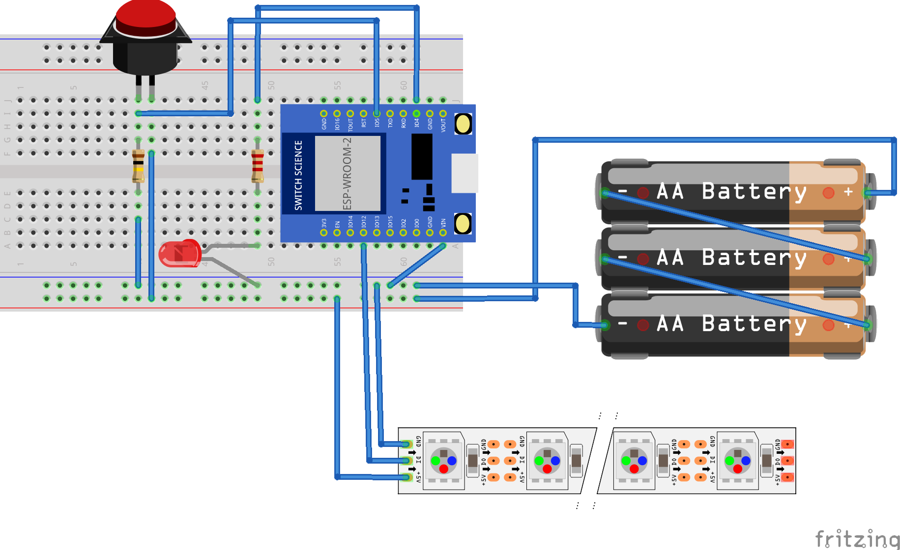

# ROAD OF LIGHT ～トイレへ導く光の道～

## なにそれ

ボタン押すとNeoPixelが光るだけのやつです。あと通知してくれます。  
わたしの娘氏プロジェクト 2017/12 の成果物です。

詳しくは、[IoTで親子の絆を深められるか・・・と思ったけど作るのがやっとだった話](http://tong-chang.hatenablog.com/entry/2017/12/05/IoT%E3%81%A7%E8%A6%AA%E5%AD%90%E3%81%AE%E7%B5%86%E3%82%92%E6%B7%B1%E3%82%81%E3%82%89%E3%82%8C%E3%82%8B%E3%81%8B%E3%83%BB%E3%83%BB%E3%83%BB%E3%81%A8%E6%80%9D%E3%81%A3%E3%81%9F%E3%81%91%E3%81%A9) をご参照ください。

## 必要なもの(物理)

* [ESPr® Developer（ESP-WROOM-02開発ボード） - スイッチサイエンス](https://www.switch-science.com/catalog/2500/)
* タクトボタン(a接点のもの)
* NeoPixel RGB

## でぃぺんでんしーず

* [adafruit/Adafruit_NeoPixel: Neo Pixels!](https://github.com/adafruit/Adafruit_NeoPixel)
* [pokiiio/ESP8266IFTTT: an IFTTT Webhook trigger library for ESP8266 dev boards.](https://github.com/pokiiio/ESP8266IFTTT)

## どうやって使うのか

* 下記の図の通りにそれぞれを接続してください

* git clone してArduino IDEでESPr-Developer-02 にファームを書き込みます
* 電池を入れて動作させてください
* ボタンを押すと、ネットワーク接続⇒通知送信⇒NeoPixel制御、と動作します

## 参考にしたもの

* [NeoPixel と紙で フルカラー LED イルミネーション オブジェを作ってみた | mgo-tec電子工作](https://www.mgo-tec.com/blog-entry-neopixel-paper-illumination01.html)
* [ESP-WROOM-02単体でWi-Fi通信とNeoPixel両方動かしたい（1） – m31](http://m31.fool.jp/archives/525)
* [arduino使い方：スイッチの入/切でＬＥＤを点灯](http://www.geocities.jp/zattouka/GarageHouse/micon/Arduino/SWtoLED/SWtoLED.htm)
* [技適済み格安高性能Wi-FiモジュールESP8266 コピペでWiFi接続出来るArduinoIDE用ソースコードとその解説 - Qiita](https://qiita.com/azusa9/items/7f78069cb09872cf6cbf)

